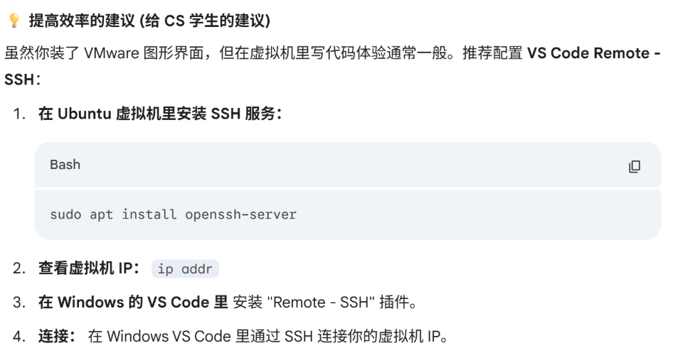

- 选择版本：2020 Fall （ 官网 [6.S081 2020 Fall](https://pdos.csail.mit.edu/6.828/2020/schedule.html) ）
- [cswiki 上的介绍](https://csdiy.wiki/%E6%93%8D%E4%BD%9C%E7%B3%BB%E7%BB%9F/MIT6.S081/)，上面也有一些资源参考，比如博客
- [降星驰的笔记](https://github.com/starrybamboo/OS_note)

---

#### 环境搭建
- 安装VMware 16/17 + Ubuntu 20.04.6 LTS 

&nbsp;

- 安装工具 tmux vim tree htop curl wget 等

---

#### Vim 的配置
见 .vimrc 文件，具体的使用方法见 vim.pdf

---

