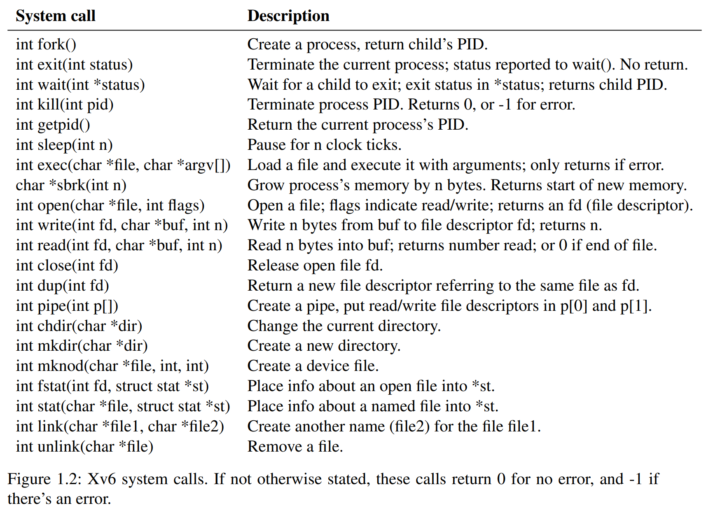

#### Problem
- 虚拟机网络问题，连不上网/用不了vpn（ai推荐开启tun模式）

- Q：如何自己写一个shell，然后加载到系统里；shell能以一个终端的图形界面形式展现出来，显然不“普通”吧。 
  - A：首先要区分两个程序：**Terminal & shell**；Terminal是一个GUI程序，负责加载图形界面（类似前端）；shell类似一个文本处理器，接收与处理用户输入的命令（类似后端）；每次运行Terminal，它会开启新进程来运行配置文件中指定的程序，比如shell，同时把自己的管道和shell的管道连接起来（这样就能在终端里输入输出了）。因此，可以修改配置文件里的启动命令为其它任意的程序，比如python。这是一种 **解耦** 的思想。

- Q：在xv6项目下，从运行 make qemu 到xv6系统启动完成，这一整个过程会经历什么？

---

#### Unix介绍短片
[Unix](https://www.youtube.com/watch?v=tc4ROCJYbm0)
- Kernighan 在《Unix传奇》这本书里提到了这次电视采访。
- Unix、C、shell
- 三层结构、管道、文件系统(hierarchy)、modules思维

--- 

#### Preparation
**Chapter 1：Operating ystem interfaces**
- system calls：由kernel定义，暴露给user的接口；
- hardware protection：不同区域的硬件访问等级不同；
- shell：一个普通的用户级交互程序，用于读取和执行用户的命令；

**1.1 Process & memory**
xv6 提供的system calls 如下表：

- process：拥有一个 user-space memory 以及一个 state（由kernel维护）；
- `int fork()`: 创建子进程，复制父进程的内存空间；return PID
- `int wait(int *status)`：传入的是一个指针类型；`int exit(int status)`：(status) 0表示成功，1表示失败
- `int exec(char *file, char *argv[])`：大部分执行程序会忽略 argv[0](一般表示命令名)

关于以上的系统调用，可以联系xv6的shell程序，阅读main片段（**/user/sh.c:145**）：

**1.2 **

